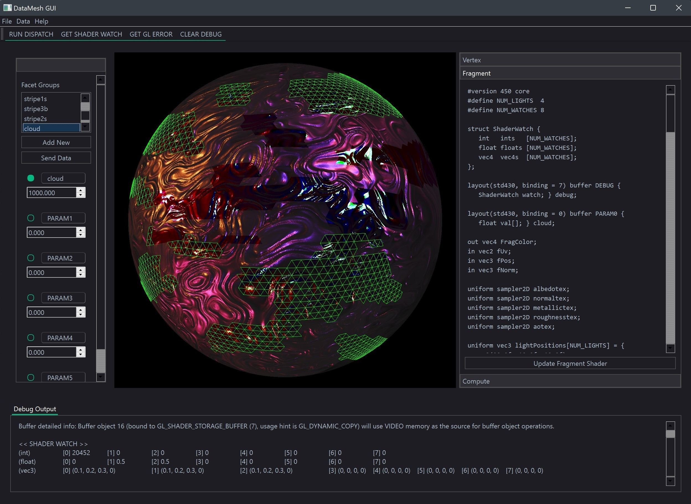

# GLSL DataMesh

---
## Features / Implementation : Summer 2022
---

### Data management

- [x] Save session (mesh & metadata)
- [ ] Load / render multiple meshes

### Interactivity (3D)

- [x] 3D selection
  - [x] Add / remove from selection
- [x] Camera control
  - [x] Trackball / orbit

### Interactivity (GUI)

- [x] Shader Editor
- [ ] Mesh list
- [ ] Lights
  - [ ] List
  - [ ] Creator
  - [ ] Editor

### Feedback (GUI)

- [x] Viewport
  - [x] Box Select
  - [x] Highlight Selected (Wireframe)
  - [ ] Coordinate Axes
- [x] Status bar
  - [ ] Selected metadata val (avg)
  - [ ] Tool information

### Rendering
- [x] Hot-swap draw shader
- [ ] Deferred rendering
- [ ] Post-processing
  - [ ] Blur (Depth of field)
  - [ ] Emission / Glow

### Backend / Solver
- [x] GPU Compute
- [ ] Multithreaded computation
- [x] Neighboring facet tracking
- [ ] Generate heatmap using FEM
- [ ] ML (Python) linking

---
## Features / Implementation : Spring 2022
---
### Data management

- [x] Geometry loading (.obj - assimp)
- [x] Temperature load/save as binary .dat

### Interactivity (3D)

- [x] 3D selection
  - [x] Individual
  - [x] Group (Box)
- [x] Camera control
  - [x] Free Rotation
  - [x] Pan

### Interactivity (GUI)

- [x] Edit temperature
  - [x] Apply text entry to selected

### Feedback (GUI)

- [x] Colormap legend (temperature)
- [x] Mesh / Model info

### GPU / OpenGL

- [x] Framebuffer (off-screen) selection
- [x] Variable size datalayer via SSBO
- [x] Highlight Selected Elements
  - [x] Solid (in fragment shader)

---
## Reference
---

### QT Docs

- [Qt OpenGL](https://doc.qt.io/qt-6/qtopengl-index.html)
- [Qt OpenGL C++ Classes | Qt OpenGL](https://doc.qt.io/qt-6/qtopengl-module.html)
- [QOpenGLFunctions Class | Qt GUI 6.2.4](https://doc.qt.io/qt-6/qopenglfunctions.html)
- [QOpenGLWidget Class | Qt OpenGL](https://doc.qt.io/qt-6/qopenglwidget.html)
- [QOpenGLWindow Class | Qt OpenGL](https://doc.qt.io/qt-6/qopenglwindow.html)

### Qt Tutorials

- [OpenGL Window Example | Qt OpenGL](https://doc.qt.io/qt-6/qtopengl-openglwindow-example.html)

### Misc Ref

- [The Asset-Importer-Lib Documentation](https://assimp-docs.readthedocs.io/)
- [Paul Bourke .obj](http://paulbourke.net/dataformats/obj/)
- [Wavefront .obj file - Wikipedia](https://en.wikipedia.org/wiki/Wavefront_.obj_file)

### Misc Tutorials
- [LearnOpenGL - Assimp](https://learnopengl.com/Model-Loading/Assimp)
- [ICS - Qt / OpenGL / ASSIMP](https://www.ics.com/blog/qt-and-opengl-loading-3d-model-open-asset-import-library-assimp)

### Blender Source
- [bsrc - Main](https://github.com/blender/blender)
- [bsrc - view3d_select.c](https://github.com/blender/blender/blob/594f47ecd2d5367ca936cf6fc6ec8168c2b360d0/source/blender/editors/space_view3d/view3d_select.c)
